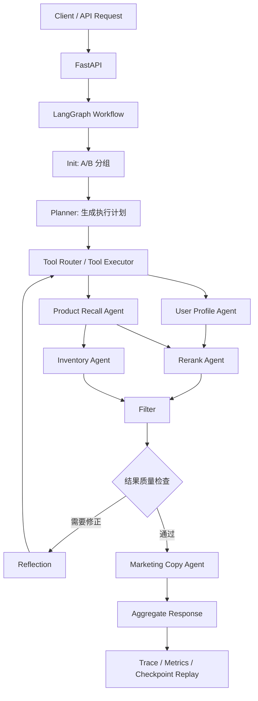

# Multi-Agent E-Commerce Recommendation System

## 一句话介绍

这是一个面向电商推荐场景的多 Agent 推荐工作流后端，用 FastAPI 接收推荐请求，通过规划、召回、重排、库存过滤、文案生成和可观测链路，解决“如何把一次推荐请求拆成可调试、可回放、可降级的工程流程”的问题。

## 项目亮点 / 核心能力

- 多 Agent 工作流编排：把推荐链路拆成 Planner、用户画像、商品召回、库存过滤、文案生成等节点，让每一步职责清晰、结果可追踪。
- 规则 + LLM 双路径规划：Planner 先生成稳定的规则计划，再在有 API Key 时用 LLM 优化策略，并在超时或解析失败时自动回退。
- 数据库商品召回与库存过滤：商品来自 SQL 数据库，推荐结果会经过库存快照校验，避免优先推荐无库存商品。
- RAG 风格检索与重排：基于用户上下文、近期行为和商品文本做召回，再结合规则或 LLM 对候选商品排序。
- Redis 实时特征增强：可选接入 Redis 记录浏览、点击、购买行为，并聚合为短期兴趣、长期偏好和风险标签。
- Trace、Metrics 与 Replay：每次 Graph 请求会返回节点 trace、耗时、Agent 结果，并支持用 SQLite checkpoint 回放调试。

## 技术栈

- Python 3.12
- FastAPI / Uvicorn
- LangGraph
- LangChain / OpenAI-compatible LLM
- Redis
- PostgreSQL / SQLite
- SQLAlchemy
- Pydantic v2
- Docker / Docker Compose
- pytest
- Prometheus metrics

## 系统架构 / 流程图



请求默认走 `/api/v1/recommend`，优先使用 LangGraph；如果 Graph 异常，会降级到 Supervisor 编排。`/api/v1/recommend/graph` 只走 Graph，更适合演示 trace 和 replay。

## 核心模块说明

- Planner：根据场景、用户上下文和业务目标生成 `ExecutionPlan`，决定召回策略、重排重点、文案语气和风险策略。
- Recall / Rerank：从商品库读取候选商品，结合用户兴趣、RAG 检索结果、A/B 配置和执行计划进行排序。
- Reflection：当结果过少、文案数量不匹配或类目过于单一时，自动调整计划并重新进入部分流程。
- Tool Registry：提供轻量工具机制，例如提升热门商品、增强多样性、切换留存保护策略。
- Tool Router / Strategy Policy：根据 Planner 输出和 Reflection 提示选择是否执行策略工具，例如热门提升、多样性增强、留存保护等，并把策略变化写回 `plan_payload`。
- Trace / Replay：记录每个节点的输入产出摘要、耗时和错误，并用 SQLite checkpoint 支持按 `thread_id` 或 `request_id` 回放。

## 快速启动

### 1. 安装依赖

```powershell
python -m venv .venv
.\.venv\Scripts\python.exe -m pip install -r requirements.txt
.\.venv\Scripts\python.exe -m pip install -r requirements-dev.txt
```

### 2. 配置环境变量

```powershell
Copy-Item .env.example .env
```

本地无 LLM API Key 也可以运行，系统会走规则 fallback。常用配置：

```text
ECOM_LLM_API_KEY=
ECOM_LLM_BASE_URL=https://api.minimaxi.com/v1
ECOM_LLM_MODEL=MiniMax-M2.7
ECOM_PLANNER_USE_LLM=false
ECOM_DATABASE_URL=sqlite:///./ecommerce.db
ECOM_PRODUCT_AUTO_SEED=true
ECOM_PRODUCT_SEED_COUNT=240
ECOM_ORCHESTRATION_MODE=graph
ECOM_CHECKPOINT_BACKEND=sqlite
ECOM_CHECKPOINT_SQLITE_PATH=./ecommerce_checkpoints.db
```

### 3. 启动 API

```powershell
.\.venv\Scripts\python.exe -m uvicorn main:app --host 127.0.0.1 --port 8000 --reload
```

健康检查：

```text
GET http://127.0.0.1:8000/health
```

### 4. Docker Compose 启动

Docker Compose 会同时启动 API、Redis 和 PostgreSQL：

```powershell
docker compose up -d --build
```

Docker Compose 默认支持无 LLM API Key 启动，Planner 会先走规则计划；如需启用 LLM 链路，可在 `.env` 中配置 `ECOM_LLM_API_KEY` 并设置 `ECOM_PLANNER_USE_LLM=true`。

访问地址：

```text
API:    http://127.0.0.1:8000
Docs:   http://127.0.0.1:8000/docs
Health: http://127.0.0.1:8000/health
```

## 接口或运行示例

### 推荐请求

```http
POST /api/v1/recommend/graph
Content-Type: application/json
```

```json
{
  "user_id": "u_demo_001",
  "scene": "homepage",
  "num_items": 3,
  "business_goal": "conversion",
  "context": {
    "recent_views": ["audio", "headphones", "Sony"],
    "avg_order_amount": 1800,
    "price_sensitivity": 0.6,
    "trigger_event": "browse"
  }
}
```

### 响应重点字段

```json
{
  "request_id": "...",
  "thread_id": "...",
  "products": [
    {
      "product_id": "P015",
      "name": "Sony 通勤降噪耳机",
      "category": "耳机",
      "price": 1299,
      "stock": 32
    }
  ],
  "marketing_copies": [
    {
      "product_id": "P015",
      "copy": "适合通勤场景的降噪耳机，兼顾音质与便携性。"
    }
  ],
  "experiment_group": "control",
  "plan_payload": {
    "retrieve_strategy": "hybrid",
    "rerank_focus": "balanced",
    "copy_tone": "default",
    "risk_policy": "standard"
  },
  "trace_steps": [],
  "node_latency_ms": {},
  "agent_results": {}
}
```

### Replay

```text
GET /api/v1/recommend/graph/replay/{thread_id}
GET /api/v1/recommend/graph/replay/by-request/{request_id}
```

## 测试与结果

运行全部测试：

```powershell
.\.venv\Scripts\pytest.exe
```

当前测试覆盖方向：

- Planner 规则计划、LLM JSON 修复和 fallback。
- ProductRecAgent 的召回、重排、RAG 检索和 A/B 重排策略。
- Redis FeatureStore 与 MemoryContext 的用户特征聚合。
- InventoryAgent 从数据库读取库存快照。
- LangGraph 节点路由、reflection、checkpoint replay。
- FastAPI 商品接口、推荐接口和 OpenAPI schema。
- A/B 分组、指标记录和事件 outcome 回写。

也可以运行冒烟测试：

```powershell
.\scripts\smoke_test.ps1 -Port 8000 -UserId u001 -NumItems 5
```

离线评估示例：

```powershell
.\.venv\Scripts\python.exe scripts\evaluate_recommendation.py --num-users 30 --k 5
```

评估脚本会输出 coverage、diversity、hit_rate@k、fallback_rate、平均延迟和 P95 延迟。

## 项目边界 / 后续优化

这个项目是推荐工作流后端示例，不是完整生产级电商系统。当前边界包括：

- 没有前端页面、用户账号、订单、支付和购物车。
- 商品库是 demo catalog，默认 seed 到 SQLite 或 PostgreSQL。
- 推荐模型以规则、轻量检索和可选 LLM 重排为主，不包含训练好的协同过滤或深度推荐模型。
- Redis 特征、A/B 实验状态和 metrics 主要用于演示，部分数据仍是进程内状态。
- 库存过滤只读库存快照，不支持锁库存、扣减库存和并发一致性。
- 文案合规检查是简单敏感词替换，不能替代真实法务或广告审核。
- CORS、鉴权、限流、审计日志、租户隔离等生产安全能力还未完善。

后续可以继续补充：

- 接入真实商品中心、用户行为流和离线画像。
- 将 A/B 实验、指标和用户画像持久化。
- 接入生产级向量库和更完整的召回策略。
- 增加鉴权、限流、日志脱敏和可观测平台。
- 用真实数据做离线评估和线上实验统计。

## 来源与声明

本项目参考并改造自开源项目：

- https://github.com/bcefghj/multi-agent-ecommerce-system

当前仓库在原项目基础上做了 Python 后端整理、商品数据库接入、LangGraph workflow、Planner/Reflection/Replay、Redis 特征、A/B 测试、指标接口、Docker Compose 和面试演示文档等扩展。项目仅用于学习、演示和面试说明，不建议直接作为生产系统使用。
